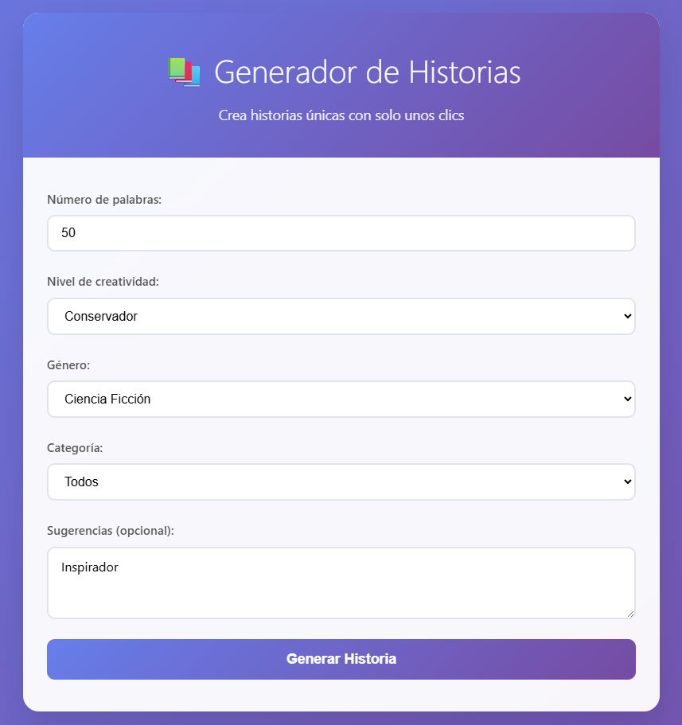

# 📚 Generador de Historias - Frontend

Una aplicación web minimalista y elegante para generar historias únicas usando inteligencia artificial.



## 🚀 Características

- **Interfaz minimalista**: Diseño limpio y moderno con gradientes atractivos
- **Formulario intuitivo**: Campos para personalizar la generación de historias
- **Validación en tiempo real**: Feedback inmediato sobre errores de entrada
- **Estados de carga**: Indicadores visuales durante la generación
- **Funcionalidad de copiado**: Copia fácilmente las historias al portapapeles
- **Responsive design**: Funciona perfectamente en dispositivos móviles y desktop
- **Manejo de errores**: Mensajes claros cuando algo sale mal

## 📁 Estructura del Proyecto

```
stories-generator-frontend/
├── index.html          # Página principal
├── css/
│   └── styles.css      # Estilos de la aplicación
├── js/
│   └── app.js          # Lógica de la aplicación
└── README.md           # Documentación
```

## 🛠️ Tecnologías Utilizadas

- **HTML5**: Estructura semántica y accesible
- **CSS3**: Estilos modernos con gradientes, animaciones y responsive design
- **JavaScript (ES6+)**: Lógica de la aplicación con async/await y fetch API

## 🎨 Diseño y UX

### Paleta de Colores
- **Primario**: Gradiente púrpura-azul (#667eea → #764ba2)
- **Secundario**: Verde para acciones exitosas (#28a745)
- **Error**: Rojo para errores (#dc3545)
- **Neutro**: Grises para texto y bordes

### Características de UX
- Animaciones suaves y transiciones
- Feedback visual inmediato
- Scroll automático a resultados
- Estados de hover y focus bien definidos
- Scrollbar personalizada

## 📋 Funcionalidades

### Formulario de Generación
- **Número de palabras**: Campo numérico (50-2000 palabras)
- **Nivel de creatividad**: Select con 3 opciones
  - Conservador
  - Creativo (por defecto)
  - Locura de creatividad
- **Género**: Select con 8 géneros literarios
- **Categoría**: Select con 3 opciones
  - Todos
  - Adolescente
  - Infantil
- **Sugerencias**: Campo de texto opcional para ideas adicionales

### Validación
- Validación en tiempo real de campos requeridos
- Límites de palabras configurados
- Mensajes de error específicos por campo
- Prevención de envío con datos inválidos

### Comunicación con Backend
- Endpoint configurable en `js/app.js`
- Manejo de errores de red
- Timeout y reintentos (preparado para implementar)
- Logging detallado para debugging

## ⚙️ Configuración

### Backend URL
Edita la configuración en `js/app.js`:

```javascript
const CONFIG = {
    API_URL: 'http://localhost:8000', // Cambiar URL por la del backend en ejecución.
    ENDPOINTS: {
        GENERATE_STORY: '/generate-story'
    }
};
```

### Límites de Palabras
Puedes ajustar los límites en la misma configuración:

```javascript
WORD_LIMITS: {
    MIN: 50,
    MAX: 2000
}
```

## 🚀 Cómo Usar

1. **Abrir la aplicación**: Simplemente abre `index.html` en tu navegador
2. **Configurar parámetros**: Completa el formulario con tus preferencias
3. **Generar historia**: Haz clic en "Generar Historia"
4. **Ver resultado**: La historia aparecerá en la sección inferior
5. **Copiar historia**: Usa el botón "Copiar" para guardar en el portapapeles

## 🔧 Desarrollo

### Estructura del Código

#### HTML (`index.html`)
- Estructura semántica con secciones bien definidas
- Formulario con validación HTML5 nativa
- Áreas para resultados y errores

#### CSS (`css/styles.css`)
- Organizado por secciones (reset, layout, componentes, responsive)
- Variables CSS para consistencia
- Animaciones y transiciones suaves
- Media queries para responsive design

#### JavaScript (`js/app.js`)
- Arquitectura modular y bien comentada
- Manejo de estado de la aplicación
- Validación robusta de formularios
- Comunicación asíncrona con el backend
- Manejo de errores completo

### Buenas Prácticas Implementadas

#### HTML
- ✅ Estructura semántica
- ✅ Accesibilidad básica (labels, alt text)
- ✅ Meta tags apropiados
- ✅ Viewport para responsive

#### CSS
- ✅ Reset CSS básico
- ✅ Organización por secciones
- ✅ Responsive design
- ✅ Animaciones optimizadas
- ✅ Variables para consistencia

#### JavaScript
- ✅ Código modular y comentado
- ✅ Manejo de errores robusto
- ✅ Validación en tiempo real
- ✅ Estados de carga
- ✅ Logging para debugging

## 🔗 Integración con Backend

### Formato de Solicitud
```json
{
    "word_count": 300,
    "creativity_level": "creativo",
    "genre": "fantasia",
    "category": "todos",
    "suggestions": "Un dragón en una montaña nevada"
}
```

### Formato de Respuesta Esperado
```json
{
    "story": "Érase una vez...",
    "metadata": {
        "word_count": 300,
        "genre": "fantasia",
        "category": "todos",
        "generated_at": "2024-01-01T12:00:00Z"
    }
}
```

### Manejo de Errores
- Errores de red (CORS, timeout, etc.)
- Errores del servidor (4xx, 5xx)
- Errores de validación del backend
- Mensajes de error amigables para el usuario

## 🧪 Testing

### Funcionalidades a Probar
- [ ] Validación de formulario
- [ ] Comunicación con backend
- [ ] Manejo de errores
- [ ] Funcionalidad de copiado
- [ ] Responsive design
- [ ] Estados de carga

### Configuración para Producción
1. Cambiar `API_URL` a la URL de tu backend en producción
2. Configurar CORS en el backend
3. Optimizar assets (minificar CSS/JS)
4. Configurar HTTPS

## 🆘 Soporte

Si encuentras algún problema o tienes sugerencias:

1. Revisa la consola del navegador para errores
2. Verifica la configuración del backend
3. Asegúrate de que CORS esté configurado correctamente
4. Revisa la documentación del backend

---

**¡Disfruta creando historias únicas! 📖✨** 